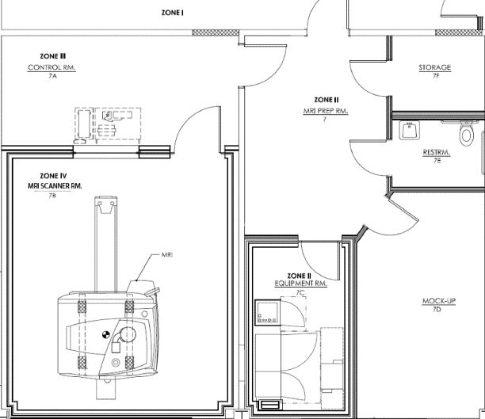

** D R A F T revision 2013-11-04 **
# Penn State 
# Social, Life, & Engineering Sciences Imaging Center (SLEIC)

## 3T MRI Safety & Security 
## Standard Operating Procedures Manual

### Document History

|Modified  |By          |Comment            |
|----------|------------|-------------------|
|2013-10-11|Rick Gilmore|Based on 2013-06-25|
|2013-10-21|Rick Gilmore|Minor edits        |
|2013-11-04|Rick Gilmore|Emails to Safety Committee List|
|2013-11-04|Rick Gilmore|Merged quench procedures|

## 1. Purpose

The purpose of this **Standard Operating Procedures Manual (SOPs)** is to provide a resource for safe MRI practices at Penn State's University Park campus. The SOPs are based on the American College of Radiology (ACR) Guidance Document for Safe MR Practices: 2007 ([Kanal et al., 2007](kanal-07-acr-mri-safety.pdf)) and the most recent version of the ACR Guidance Document on MR Safe Practices: 2013 ([Kanal et al., 2013](kanal-13-acr-mri-safety.pdf)).

## 2. Definitions

### SLEIC MRI Safety Committee

The SLEIC MRI Safety Committee is a group of experts charged with overseeing and reviewing SLEIC's safety policies, procedures, and documents. The Safety Committee meets at least twice a year. Members are appointed by the Director of Human Imaging with input from existing committee members, SLEIC staff, and other experts. Members must have expertise in MRI or a discipline related to research ethics and safety. 

The current composition of the Safety Committee is as follows:

- **Rick O. Gilmore**, Ph.D., SLEIC Director of Human Imaging, Associate Professor of Psychology, Chair, <rog1@psu.edu>
- **Nancy Dennis**, Ph.D., Assistant Professor of Psychology, <nad12@psu.edu>
- **Debra Weston**, SLEIC MR Technologist, <dlw54@psu.edu>
- **Charles Geier**, Ph.D., Assistant Professor of Human Development and Family Studies, <cfg2@psu.edu>
- **Joanna (Josy) Lyons**, Office of Research Protections, <jlm38@psu.edu>
- **Tim Mosher, M.D.**, SLEIC Medical Director, Director of Research, CNMRR, <TMOSHER@hmc.psu.edu>
- **Thomas Neuberger**, Ph.D., Director of SLEIC High Field MRI Facility, Assistant Professor of Bioengineering, <tun3@psu.edu>

### SLEIC Medical Director
A physician, typically a radiologist, whose responsibilities include ensuring that MR safe practice guidelines are established and maintained as current and appropriate for SLEIC. 

### SLEIC MR Safety Officer
A person with expertise in MR safety who is responsible for developing safety training and delivering it to staff and researchers.

### SLEIC MR Technologist
An individual with specialized training and certifications that qualify him or her to run the MR scanner.

### SLEIC Director of Human Imaging (SLEIC Director)
A faculty or staff member who directs the scientific and administrative operations of SLEIC. It is the responsibility of the site’s administration to ensure that the policies and procedures that result from these MR safe practice guidelines are implemented and adhered to at all times by all of SLEIC's personnel.

### SLEIC MR Physicist
A faculty or staff member with advanced training in MR Physics.

### Investigator (PI)
A faculty or staff member, postdoctoral researcher or graduate student who conducts IRB-approved research at SLEIC.

### Participant
An individual who agrees to participate in research at SLEIC.

## 3. Nature of the risk
The use of magnetic resonance imaging (MRI) presents known safety hazards. MRI safety guidelines have been developed so that investigators, researchers, students, colleagues, study participants, and associated equipment remain safe in the magnet environment. The principal sources of risk include the following:

- The static or main magnetic field
	- The strong magnetic field is always present.
	- Ferromagnetic metal objects can become airborne projectiles when placed in a strong magnetic field. 
	- The strength of the field increases superlinearly with distance from the magnet bore, and even handoheld objects can be jerked free very suddenly as the holder moves closer to the magnet.
	- Objects that are ferromagnetic may pin someone against the magnet in a life threatening situation.
	- Metallic objects in the body can also have dangerous effects when placed in a magnetic field. 
	- Ferromagnetic metal implants or fragments may twist or move, causing internal injury.
- The Radio Frequency (RF) pulses
	- MRI scans use radio frequency pulses. 
	- RF pulses may cause tissue heating or burns.
	- The FDA sets limits to the amount of heating or the Specific Absorption Rate (SAR) that is allowed.
	- RF may damage electronic or implanted medical devices.
	- RF fields can cause burns by producing electrical currents in conductive loops. 
	- When using equipment such as surface coils, ECG or EEG leads, researchers must be extremely careful not to allow the wire or cable to form a conductive loop with itself or with the subject. 
	- Equipment that is not RF-shielded may be damaged or may cause spurious signals when operated in the magnetic field.
- The Gradients or Time Varying Magnetic Fields
	- Rapidly changing gradient fields used in MRI have the potential to cause peripheral nerve stimulation (PNS).
	- Gradients produce excessive acoustic noise levels for which hearing protection must be provided and worn.
- Acoustic noise
	- For anatomical imaging, the noise is mostly of low frequency and has a "clunking" sound; for EPI, the noise can be of very high frequency (600-1400 Hz) and sounds like a loud "beep". Generally, the higher gradients used with higher magnetic fields and with EPI produce more intense noise. Prolonged exposure to this noise will damage the unprotected ear. 
	- Additional noise in the magnet environment comes from the magnet coolant pump, air handling system, and patient fan. While not dangerous, these other sources of noise can be annoying to subjects and can interfere with communication.
- Devices, objects, and equipment used for experiments
	- All equipment placed in the magnetic environment must be considered for heating or any other potential safety risk.
	- Equipment in the magnetic environment may also pose a projectile risk.
- Infection
	- Many different individuals will come in physical contact with the MRI scanner and research equipment.
	- The scanning table, other surfaces, and linens that have come in contact with research participants pose infection risks.
- Pregnancy
	- There are no known adverse effects of MRI on developing fetuses. 
	- A recent survey found no association between working in the MR environment and a number of pregnancy outcome variables.
	- Nevertheless, as with all interventions during pregnancy, it is prudent to screen women of reproductive age for pregnancy prior to permitting them access to MR imaging environments.
- Incidental Findings
	- It is possible that a health-related condition or abnormality will be revealed during the course of a research study. These conditions may pose a risk to health, or disclosure may affect employment, health insurance eligibility, or reputation.
- Violation of confidentiality
	- Sensitive information must be revealed to the MR Technologist and in some cases research staff as part of safety screening.
- MRI System Quench
	- The MRI magnet is maintained at a high field strength by means of super-cooling its conductive loops of wire with liquid helium, which is at an extremely low temperature – close to absolute zero (about 4°K). In certain circumstances, this helium may be rapidly vented off, warming the magnet and causing it to quickly lose its magnetic field. This is known as a **quench.** A quench may be initiated either in a controlled fashion by pressing one of the tw- Magnet Stop buttons, in which case the helium is safely vented to the outside of the building or, in extraordinary situations, such as an earthquake or an explosion, it is possible for an uncontrolled quench to occur, in which case the helium may vent into the room making breathing difficult.
- Fire or Other Emergency

## 4. Policies and Procedures

All of SLEIC's policies and procedures are designed to mitigate risk from participation in a research study.

### 4.1 Magnet Operations

#### Policies

- SLEIC maintains a safe and orderly operational environment.
- Only qualified persons may operate the 3T MR scanner.
- The scanner is maintained regularly by trained personnel from the manufacturer, Siemens. Any system problems are reported promptly to the Siemens.
- Sequences and coils not yet approved by the Food and Drug Administration (FDA) should only be used under the following conditions:
- Overriding or disabling the Siemens Specific Absorption Rate (SAR) and rate of magnetic field change (dB/dt) monitoring software is prohibited.
- Access to the control room (Zone III) and magnet room (Zone IV) are strictly controlled.
- At least two safety-trained personnel must be on hand and in the control room (Zone III) or magnet room (Zone IV) when the magnet is in operation. This will usually be the MR Technologist and a member of the research team.
- With the exception of SLEIC staff, all personnel present must be included on the project's IRB protocol. It is responsibility of the project PI to ensure that all personnel present are included on the approved IRB protocol. 
- The MR Technologist will take the lead on any emergency response procedures, with the help of the second person present.

#### Procedures

##### Staff qualifications

- The only individuals approved to run the 3T scanner are the MR Technologist, MR Physicist, and Siemens repair staff. 
- Individuals approved to scan humans (not phantoms) must have MRI Technologist certification with at least one year of experience in the field or have an M.D. or Ph.D. and at least 1 year of previous experience scanning human participants. 

##### Key and building access

- The MR Technologist, MR Physicist, and Director of Human Imaging have keys to the magnet room. There is a lockbox in the control room that also contains a key to the magnet. Only the MR Technologist, the MR Physicist, The Director of Human Imaging, and Siemens have the combination for the lockbox.
- A SLEIC staff member or authorized MR Technologist must be present for access to the magnet room (Zone IV). 
- Access to the control room (Zone III) will usually require a SLEIC staff member or authorized MR Technologist to be present since investigators do not have key access to this zone. The exception to this rule are IT staff and Siemens or OPP maintenance staff. Once granted access, these personnel may work in Zone III without SLEIC staff present, so long as access to Zone IV is not required, and the door to the magnet room remains locked.
- Chandlee is open to the public M-F during business hours. Chandlee entrances automatically lock at 5:00 pm on weekdays. Access to Chandlee after 5:00 pm and on weekends requires a key-card. PIs may request key-card access to Chandlee. There are key-card access points at the loading dock door and the front door facing Pollock Road.
- Upon request, one set of keys will be granted to each PI.  The keys open the doors to rooms 6 (waiting room), 6A (interview room), 7 (prep room), and 7D (mock scanner room).  The keys will not open the control room or magnet room.  
- To request a key, PIs should fill out the key request form and turn it in to SLEIC staff.
- PIs will be required to turn in keys if their project(s) are complete and they are no longer collecting data.

##### Non-FDA Approved Pulse Sequences and Coils

- Sequences obtained through the Siemens Works in Progress (WIP) program will be used as provided.
- All non-FDA approved sequences will be evaluated by the SLEIC MR Physicist for potential safety issues.
- Non-FDA approved coils may not be used on humans without an approved IRB protocol.
- Use of pulse sequences and/or coils outside of these conditions and intended for human or animal studies must be reviewed by the Office of Research Protections for a determination of risk. 

##### Magnet Emergency

###### Intentional Quench

If someone or something is stuck to the magnet and there is a threat to life or limb, the intentional quench procedure should be followed by an authorized person. Under almost all circumstances, the decision to quench the magnet should be made by the MR Technologist or MR Physicist alone, unless he or she is incapacitated or absent or is the person whose life or well-being is affected. The intentional quency procedure is as follows:

1. Prop doors open.
	- Open scanner room door completely and prop open using orange doorstop.  
	- Open the control room door and prop open using a doorstop. 
	- Open the hallway door and prop open using a doorstop.
2. Reassure victim if the victim is conscious. Inform them that the quench will release them and that they will hear a loud roar. 
3. Flip cover up and push quench button. Quench will take 3-4 min.
4. Stay in the control room to prevent anyone from entering the scanner room until the magnetic field has come down.
5. Call for Help.
	- Call 911 if the victim is in need of emergency care. 
State "There has been an incident with an MRI scanner and someone is pinned to the magnet, please send an ambulance.  We are in the basement of Chandlee Laboratory room 7 at Penn State University, University Park 16802. There are 3 MRI scanners in the basement of Chandlee, so please inform emergency responders to be cautious."
	- Call Rick Gilmore (814) 777-3298.  Dial 8-777-3298 from control room.
	- Call Amanda Gearhart (717) 250-4408.  Dial 8-1-717-250-4408 from control room phone.
6. Call Environmental Health and Safety (EHS)
	- Call (814) 865-6391 Monday-Friday 8 am-5 pm
	- Call (814) 863-1111 (University Police) all other times.  After hours, University Police will notify the appropriate EHS staff member to provide assistance.
7. Call Siemens 1-800-888-7436. Dial 8-1-800-888-7436 from control room phone.  Press 2 then press 1 and give them the system ID number (213542).  Tell Siemens that the magnet has quenched and this is an emergency.

###### Unintentional Quench
If the magnet quenches accidentally without the button being pushed, follow this procedure:

1. If there is a person in the scanner room
	a. Prop scanner room door open.  Open scanner room door completely and prop open using the orange doorstop.  
	b. Evacuate the scanner room.
2. Close and lock the scanner room door.
3. Leave the control room, go to room 6 to make phone calls.
4. Call for help.
	a. Call Rick Gilmore (814) 777-3298.  Dial 8-777-3298 from room 6.
	b. Call Amanda Gearhart (717) 250-4408.  Dial 8-1-717-250-4408 from room 6 phone.
5. Call Environmental Health and Safety (EHS)
	a. Call (814) 865-6391 Monday-Friday 8 am-5 pm
	b. Call (814) 863-1111 (University Police) all other times.  After hours, University Police will notify the appropriate EHS staff member to provide assistance.
6. Call Siemens 1-800-888-7436. Dial 8-1-800-888-7436 from control room phone.  Press 2 then press 1 and give them the system ID number (213542).  Tell Siemens that the magnet has quenched and this is an emergency.

##### Oxygen Sensor 

The oxygen sensor is a back-up system to ensure personnel safety in the event of a quench that occurs off-hours when the magnet is unattended. Certain operations of the scanner may trigger the O2 alarm when oxygen levels are unchanged. If the O2 alarm sounds during business hours the MRI Safety Officer should be contacted.  If the O2 alarm sounds during a participant's scan, the event should be noted in a 3T MRI Post Scan Problem Report Form (within 24 hrs or 1 business day of the occurrence).  The problem form is available online:
 
[https://www.imaging.psu.edu/for-investigators/frequently-used-forms/3t-mri-post-scan-problem-report-form](https://www.imaging.psu.edu/for-investigators/frequently-used-forms/3t-mri-post-scan-problem-report-form)

SLEIC MR staff will contact Environmental Health and Safety (EHS) if indicated at (814) 865-6391 Monday - Friday 8am - 5pm. 

##### Hearing Protection

Hearing protection (in the form of earplugs or headphones, or both) must be used when scanning all participants. Also, researchers, or a parent accompanying the participant, must wear earplugs if they are in the magnet room during scanning. Earplugs must be the right size and properly inserted into the ear canal to obtain their full effect. This requires instruction and practice. It is the responsibility of the researcher to see that the subject is aptly fitted with hearing protection. Additional packing of the head with foam cushions further dampens the noise and is recommended in the 3T environment. 

##### Communication during a scan

All subjects must be given the emergency squeeze ball and instructions about how to use it. The subjects are to be monitored throughout the procedure via the speaker/intercom system.

### 4.2 Safety Training

#### Policies

- Every researcher and staff member must undergo safety training annually.
- Maintainance, IT, and emergency response (Level I) personnel must undergo safety training annually.
- SLEIC uses the videos developed by Dr. Frank Shellock, Ph.D. for safety training.

#### Procedures

The SLEIC 3T MRI Safety training is designed by SLEIC personnel under the supervision of SLEIC's MRI Medical Officer and Safety Committee and is updated as needed to ensure ongoing safe operation of the 3T MRI facility. 
 
SLEIC's MRI Safety Officer or MR Technologist will conduct and supervise all safety training.    

##### Initial Safety Training for Investigators

- All members of a project's investigative team must undergo safety training.
- Investigators require more extensive training and education in the broader aspects of MR safety issues.
- The MR Safety Officer or MR Technologist administers the safety training.
- Safety Training consists of the following elements:
	- Watch Shellock safety video
	- Post video quiz
	- Site specific orientation
	- De-metaling
	- Safety quiz
- More details about the Safety Training curriculum may be found at [https://github.com/psu-sleic/policies/blob/master/safety-committee/sleic-safety-training-agenda.md](https://github.com/psu-sleic/policies/blob/master/safety-committee/sleic-safety-training-agenda.md)

##### Refresher Safety Training for Investigators

- All members of a project's investigative team must under refresher safety training, typically annually.

##### Safety Training for Level I personnel

- Level I personnel include IT and janitorial staff.
- Level I personnel require minimal training in to ensure their safety as they work within Zone III.
- Safety Training will be held annually for janitorial and IT staff.
- Safety training consists of the following elements:
	- Basic familiarity with the hazards associated with the magnetic field
		- Missile effect
		- Malfunction of implanted medical devices
	- Familiarity with the layout of the scanner suite.
		- Location and meaning of magnetic field
		- Location of scanner
	- Instruction to attend to and obey all posted signs

### 4.3 Safety Screening

#### Policies

- Any person who will enter the magnet room must pass safety screening.
- If the MR Technologist is uncertain about whether it is safe for an individual to i) enter the scanner room or ii) undergo a scan, he or she will consult the Medical Director.
- The Medical Director will make a determination about whether it is safe to scan.
- If either the MR Technologist or Medical Director have doubts about whether it is safe for a person to be scanned, that person should not be scanned.
- If there is any question about whether it is safe for a person to enter Zone IV or undergo a scan, that person shall not enter Zone IV or under go a scan.
- Participants must be screened before an appointment is scheduled (pre-visit screening) and at the time of the scheduled appointment (pre-scan screening).
- MRI scanning eligibility can change, so research participants who have completed a scanning form previously must must complete a new screening form prior to being scanned. 

#### Procedures

##### Pre-visit screening

Prior to being scheduled for a scanning visit, all potential participants must be assessed for MRI eligibility. This is usually done by the investigative team.  A thorough pre-screening prior to scheduling the scan session ensures that participants are  eligible to be scanned and that they bring any necessary documentation with them to the MRI scan session. Determining MRI eligibility may be accomplished through using the recommended phone screening questions (see Appendix C), or through a thorough in-person screening (e.g., completing the screening form in advance of scheduling the MRI), or other such method that will assure eligibility on the day of scanning.

If the investigator has any questions about a participant's eligibility after completing the pre-screening, he or she should contact the MRI Technologist by email or phone.

Participants may be required to provide documentation about any implants/devices, and participants will need to bring this documentation with them on the day of scanning.

Only after passing pre-visit screening should a participant be scheduled for a scan session.

##### Pre-scan screening

There are several components of the pre-scan screening process. 

- Completion of the SLEIC 3T MRI Safety Screening Form (see Appendix B).

	All persons must complete, **prior to entering the scanner room** (Zone IV) for the first time, an accurate and up-to-date screening form. **Research participants or others being scanned must complete a screening form prior to each scan** unless their prior scan was earlier the same day. 

	Investigators will fill out the screening form for themselves at their safety training session and SLEIC will keep a copy for its records.  This form only needs to be completed once (not every time they enter the scanner room), unless the information changes. It is the investigator's responsibility to inform the MR Technologist if the information on the screening form has changed.  If so, the investigator should fill out a new form before entering the scanner room. If an investigator wants to be scanned as a pilot subject to test their paradigm, the investigator should fill out a new form before he or she is scanned. The investigator must also sign an IRB-approved consent form or the SLEIC risk statement (see Appendix B).

- Removal of all metal items

	Before entering the magnet room, everyone must remove all metallic objects from their person, pockets, and in some cases, clothing. This includes hearing aids, dentures, partial plates, keys, beepers, cell phone, eyeglasses, hair pins, barrettes, jewelry, body piercing jewelry, watch, safety pins, paperclips, money clip, credit cards, bank cards, magnetic strip cards, coins, pens, pocket knife, nail clippers, and tools.

	If the MR Technologist determines that clothing with metal fasteners or metallic threads poses a potential risk, he or she may ask that these clothing items be removed, as well. SLEIC provides scrubs for individuals to wear if their clothing poses a potential risk.

	Lockers are provided in 7 Chandlee for securely storing belongings, including all metal items. Investigators and the MR Technologist will ensure any potentially hazardous metal items are stored in the lockers before the participant enters the magnet room.

- Review of screening form and verbal interview of participant by MR Technologist

	The MRI technologist will review the screening form and will interview the participant, investigator, or staff member. Review of the screening form information should be done in private. If there are any questions regarding the information on the screening form, the technologist will go over the screening form with the participant to gather further information in order to make a decision about whether it is safe for that person to enter the magnet room or be scanned. 

- Implants or devices

	If the participant indicates something on the screening form that may be a potential safety risk (e.g., an implant or device), the participant may be required to provide documentation about the device (e.g., a stent) before proceeding with scanning. 

	If the MR Technologist can verify from [MRISafety.com](http://MRISafety.com) that the item is safe to scan at 3T, he or she may proceed with scanning. Any documentation will be stapled to the screening form. If the MR Technologist has a question about whether a participant is safe to scan, he or she will consult the SLEIC Medical Director.

	Research teams who wish to scan individuals multiple times may wish to keep copies of any device documentation.

- Pregnancy

	Pregnant Level I and Level II personnel are permitted to work in and around the MR environment throughout all stages of their pregnancy.   However, they are requested not to remain within the scanner room during actual data acquisition or scanning. The consent form template specifies that participants must not be pregnant at the time of the scan, and participants are also asked about the possibility of pregnancy on the safety screening form.  As with all items on the safety screening form, we rely on participant's accurate self report. 

- Scanning Minors
	
There are special considerations involved in scanning minors:

- Visitors who accompany adult participants are usually asked to wait in room 6 rather than 7.  Parents of child participants may wait in room 7 in order to be near the child.
- Children may want to bring a comfort item from home (e.g., stuffed animal, blanket).  The item will be carefully checked by the MR Technologist prior to permitting the child to enter Zone IV with the object in order to ensure that it does not contain any objectionable metallic components.
- If there is a possibility that a parent would want to enter the magnet room to accompany their child, the parent must be screened using the same criteria as any visitor entering the scanner room.  If a parent wants to remain in the magnet room during scanning, they will wear hearing protection.

- Determination of eligibility to enter the scanner room or undergo a scan

	If there is ANY doubt about whether the person should be scanned, and the MR Technologist cannot verify from [MRISafety.com](http://MRISafety.com) that the item is safe to scan or gain approval from the SLEIC Medical Director that it is safe to scan, the person will NOT be scanned. **THERE ARE NO EXCEPTIONS TO THIS POLICY.**

	If the MR Technologist or MR Safety Officer determines that a person is eligible to be scanned, he or she will indicate that judgment in writing on the screening form.

### 4.4 Device, object, and equipment screening

- Ferrous objects, including those brought by participants, visitors, contractors, etc., should be restricted from entering Zone III, whenever practical.
- If there is any question about whether an item is allowed in the MRI scanner room (Zone IV) the item must be carefully checked by SLEIC MR personnel (e.g., with a handheld magnet) before it is allowed in the room.
- External devices or objects demonstrated to be ferromagnetic and MR unsafe or incompatible in the MR environment may still, under specific circumstances, be brought into the control room (Zone III) (e.g., if necessary for research purposes).  
- External devices should only be brought into the Zone III if they are under the direct supervision of specifically designated personnel who are thoroughly familiar with the device, its function, and the reason supporting its introduction to Zone III.
- The safe utilization of these devices while they are present in Zone III will be the responsibility of specifically named level 1 or 2 MR personnel.

### 4.4 IRB approval, SLEIC approval, informed consent, confidentiality, and record-keeping

#### Policies

- All research at SLEIC must be conducted under a protocol that has been approved by the IRB and by SLEIC staff.
- All individuals who enter the scanner environment or undergo a scan for research or non-research purposes must be informed about the possible risks. This must be acknowledged in writing, either by signature on an IRB approved consent form or on SLEIC's statement of risk.
- Research participants and others have a right to expect that their participation in research and the sensitive information they provide as part of a safety screening procedure will be kept confidential by SLEIC staff and researchers.

#### Procedures

##### IRB Approval of Research Protocols

Researchers must apply for and receive IRB approval to conduct research at SLEIC. 

SLEIC has created consent form templates that describe the risks of the MRI procedure. These templates have been approved by the IRB. Researchers are advised to use the IRB-approved templates (See Appendix B).

- All participants must complete an IRB-approved consent form prior to scanning.
- SLEIC will retain a copy of the consent form (1st page and signature page) of each scanned participant for the center's records.

##### SLEIC Approval of Research Protocols

SLEIC staff will review an approve protocols for use of the facility. Details about the application and approval process are posted on the SLEIC website (http://www.imaging.psu.edu).

##### Confidentiality

- Investigators are responsible for traffic management of participant arrival and departure in Chandlee, and investigators should take steps to assure participant privacy.
- Participants who are waiting for a scan and any accompanying visitors should wait in Room 6 Chandlee. Participants or visitors should not be unsupervised in the MRI prep room area of Suite 7.  However, exceptions will be made for parents/guardians of child participants.
- The verbal safety screening interview will be conducted behind a closed door with only the investigator and MR Technologist present.
- Tours of the center should be scheduled in advance in order to protect participant privacy and to avoid interrupting research in progress.

##### Record-keeping

- Because screening and consent forms contain sensitive and identifiable information, these records are stored in a locked file cabinet to which only SLEIC staff have access. The MR Technologist is responsible for storing and securing records related to scanning sessions.
- For the MRI scan, each participant will be assigned a code number that will be used throughout the scan.  Only this code (and never the participant's name) will be used when analyzing or reporting the data.  Any identifying information will be kept in a locked location and password protected electronic files. 
- SLEIC will retain a copy of the safety screening form and consent form (1st page and signature page) of each scanned participant for the center's records.  Forms will be stored in a locked location.  
- SLEIC staff will periodically do a self-audit spot check of ongoing practices by observing sessions and by double-checking forms for completeness.
- SLEIC staff will maintain records of investigators who have:
	- completed safety training 
	- completed facilities use applications 
	- been issued keys, returned keys, and have building key-card access.

### 4.5 Incidental findings, magnet quench, fire, safety incidents, & unanticipated problems

#### Policies

- Investigators are not trained to perform medical diagnosis, and the scans to be performed at SLEIC are not optimized to find abnormalities nor were they ordered by a physician.  However, on occasion, a member of the research team may notice a finding on a scan that seems abnormal. The ethical course of action is to determine whether the finding poses a risk to health and to communicate that risk to participants, if, and only if, there is such a risk.
- Fire or police personnel cannot have free access to Zone III or IV areas.  An injury or death may result from the entry of untrained personnel.
- Communication is the key to prevention. All incidents must be reported promptly.

#### Procedures

##### Incidental Findings

- If the MR Technologist or Researcher discovers an incidental finding during a scan	
	- The MR Technologist will contact the radiologist, or the MR Technologist will notify the Director and the MRI Safety Officer immediately so that they can contact the radiologist.	
- If the researcher discovers the incidental finding after the scan session during data processing and analysis, they should alert the MRI MR Technologist on duty immediately.  The MR Technologist will in turn inform the Director of Human Imaging, and inform the consulting radiologist.
- In both cases, the images will be provided to the radiologist for review.
	- If the radiologist recommends further follow-up, the participant will be contacted within 48 hours of the recommendation. The person making contact will suggest that the participant contact a private medical provider for follow-up.    
	- The PI, a senior member of SLEIC staff, the radiologist, or another designate will contact the participant. 
	- The participant should NOT be alerted about the finding by the researcher or the technologist. 
	- It is NEVER appropriate to discuss concerns about an incidental finding with the participant. 
	- Neither the researcher nor the technologist should discuss their concerns with any additional persons such as collaborators or friends. 
	- To facilitate follow-up care, the participant may be given a copy of his/her images upon request.
	- The decision as to whether to proceed with further examination or treatment lies solely and completely with the participant.  
	- If, at any time during the processing of the data, the investigator discovers an incidental finding they should fill out the 3T MRI Post Scan Problem Report form.  The form is available online: https://www.imaging.psu.edu/for-investigators/frequently-used-forms/3t-mri-post-scan-problem-report-form.

##### Fire 

- Non-MR compatible fire-fighting equipment may not be brought into Zone III or IV without SLEIC staff supervising to prevent entry beyond the 5 Gauss line.
- An MR compatible fire extinguisher is mounted on the wall in the control room (Zone III).
- It is Penn State policy that MRI scanning must be stopped in the presence of a fire alarm and the investigators and participants must evacuate the building.
- In the event that smoke or flames are detected in the vicinity of the electrical equipment, the MR Technologist should press the red Emergency Power Shutdown button (NOT the red quench button) located in the control room or in the magnet room.
- The MR Technologist is required to securely lock both the scanner room door and control room door to ensure that no emergency personnel or unscreened emergency equipment are accidentally exposed to the standing magnetic field of the MRI system.

##### Safety Incidents

- All MR safety incidents or near incidents (e.g., a paperclip flew into the scanner but no one was hurt) that occur in the MR site should be reported to the Director and the MRI Safety Officer in a timely fashion (within 24 hrs or 1 business day of their occurrence).
- The event should be noted in a 3T MRI Post Scan Problem Report Form (within 24 hrs or 1 business day of their occurrence).  The form is available online: [https://www.imaging.psu.edu/for-investigators/frequently-used-forms/3t-mri-post-scan-problem-report-form](https://www.imaging.psu.edu/for-investigators/frequently-used-forms/3t-mri-post-scan-problem-report-form) 
- In accordance with the FDA, all MR safety incidents will be reported to the FDA via their MedWatch program.
- If a participant was involved in the safety incident
	- In addition to the above, the investigator should also immediately contact the PI and inform them of the incident. 
	- The PI should follow reporting requirements as outlined in the [IRB SOP Addendum](http://www.research.psu.edu/orp/humans/policies/sops/up-sop.pdf/view)

##### Unanticipated Problems 

- If a participant experiences an unanticipated problem (e.g., an internal adverse event according to the IRB SOP definition) the scan must be stopped immediately and the participant must be removed from the scanner.
- The event should be noted in a 3T MRI Post Scan Problem Report Form (within 24 hrs or 1 business day of their occurrence).  The form is available online: [https://www.imaging.psu.edu/for-investigators/frequently-used-forms/3t-mri-post-scan-problem-report-form](https://www.imaging.psu.edu/for-investigators/frequently-used-forms/3t-mri-post-scan-problem-report-form)]
- The investigator should also immediately contact the PI and inform them of the event. 
- The PI should follow reporting requirements as outlined in the IRB SOP Addendum: 
[http://www.research.psu.edu/orp/humans/policies/sops/up-sop.pdf/view](http://www.research.psu.edu/orp/humans/policies/sops/up-sop.pdf/view).

### 4.6 Compliance

SLEIC assures compliance with these policies and procedures in several ways.

#### Office of Research Protections (ORP) Review

##### Research protocol review and approval

All research conducted at SLEIC must be done under an IRB-approved protocol. Investigators who seek to conduct MRI research at SLEIC are advised to use the screening template and informed consent template documents available on the ORP website. 
All SLEIC projects must add a SLEIC staff member to their research protocol.

Some scanning activities do not involve research and do not require an IRB-approved protocol. Nonetheless, all safety screening policies apply.

##### SLEIC policy, template document review

The ORP reviews and approves SLEIC's SOPs and template screening and informed consent documents.

#### Medical Director and Safety Committee Review

SLEIC's MRI safety practices are monitored by SLEIC's Medical Director and an appointed MRI Safety Committee. SLEIC's MRI safety committee will review the Standard Operating Procedures, reported safety concerns or questions, and ongoing practices.  

----

## Contact Information

### SLEIC Staff

| Name | Title | Office | Phone | Email |
|------|-------|--------|-------|-------|
|Rick Gilmore|Associate Professor of Psychology & Director of Human Imaging|120C Chandlee|814-867-2971 (office), 814-777-3298 (cell)|rogilmore@psu.edu|
|Amanda Gearhart|SLEIC 3T MRI Technologist & Acting MRI Safety Officer|5C Chandlee|814-867-2996 (office)|axg34@psu.edu|
|Andrea Seisler|HEF Laboratory Manager|120D Chandlee|814-865-6774 (office), 814-933-9201 (cell)|ars17@psu.edu|
|Thomas Neuberger|Assistant Professor of Bioengineering & SLEIC MR Physicist| |(814) 863-7625 (office), (814) 360-5285 (cell)|tun3@psu.edu|

NOTE: In the event that Rick Gilmore is unavailable, his designated backup person should work with the PI to resolve the situation.  

---

## Appendix A: Safety Zones

### Zone I
- Area freely accessible to the general public.  This is the hallway outside of Room 7 Chandlee.  

### Zone II
- Includes MRI Prep Room & Equipment Room
- Participants and general public must be supervised by Level II personnel in this zone.

### Zone III
- Control Room

### Zone IV
- Scanner Room
- Only SLEIC staff will have key access to Zone IV.  If any investigator or other individual requires access to Zone IV, a SLEIC staff member must be present.

---

## Appendix B: Required Forms

### SLEIC 3T MRI Facilities Use Application

To request time to pilot or run an experiment, a Facilities Use Application must be completed.  A separate Facilities Use Application must be submitted for each project.  

Investigators are required to have IRB approval before SLEIC will fully approve the facilities use application for the project

The facilities use application is online at the following links (for funded or in-kind hours):

[https://www.imaging.psu.edu/for-investigators/request-for-funded-hours
](https://www.imaging.psu.edu/for-investigators/request-for-funded-hours
)

[https://www.imaging.psu.edu/for-investigators/request-for-in-kind-hours](https://www.imaging.psu.edu/for-investigators/request-for-in-kind-hours)

### IRB-Approved Consent Form

All participants must complete an IRB-approved consent form.

SLEIC has developed template consent form language for MRI studies, available on the IRB website.   We recommend that investigators use these template forms in their IRB application.

SLEIC will retain a copy of the consent form (1st page and signature page) of each scanned participant for the center's records.

The forms are online at the following link: 

[https://www.research.psu.edu/orp/humans/conducting-study/preparing-new-application/informed-consent/guidelinesotemplatesosample-icfs](https://www.research.psu.edu/orp/humans/conducting-study/preparing-new-application/informed-consent/guidelinesotemplatesosample-icfs) 

### SLEIC Safety Risk Statement

If a visitor must enter the magnet room (Zone IV) or an investigator wants to be scanned as a pilot subject to test his or her paradigm, he or she must sign either an IRB-approved consent form or the [SLEIC 3T Safety Risk Statement](sleic-safety-risk-statement.md) available at the following link:

[https://www.imaging.psu.edu/for-investigators/frequently-used-forms](https://www.imaging.psu.edu/for-investigators/frequently-used-forms)    

### SLEIC 3T MRI Safety Screening form 

The most recent IRB approved [safety screening form](3T-safety-screening.pdf) is posted on the SLEIC website at the following link:

[https://www.imaging.psu.edu/for-investigators/3t-mri-facility/irb-information](https://www.imaging.psu.edu/for-investigators/3t-mri-facility/irb-information) 

---

## Appendix C: Phone Screening Recommendations

Also available on the SLEIC website at the following link:

https://www.imaging.psu.edu/for-investigators/3t-mri-facility/irb-information

**Please add the phone screening questions to your individual IRB protocol if you choose to use the information below in your recruiting/pre-scan-screening script**: 

### Phone Screen Questions

1. *Have you ever had any type of brain, heart, eye, or inner ear surgery?*
2. *Have you ever had anything implanted into your body?*
3. *Have you had surgery in the last 6 to 8 weeks?* 

	If the potential participant answers yes to any question (1-3), please ask the following follow-up questions (as appropriate) and contact the MRI technologist with answers to these questions in order to verify eligibility:
	- *What surgery did you have?*
	- *What was the date of the surgery?*
	- *What was implanted (if applicable)?* 
		
		If the potential participant reports having had an implant, say the following:
		
		*Since you have indicated that you have a stent, implant/device, etc. you must bring your implant card along with a description of the specifications of the implant/device. The MRI technologist will need to make a copy of this information to attach to the screening form.* 
4. *Have you had any injury to the eye involving metal?* 
5. *Have you had any injury to any body part involving metal?* 
	- *Describe the injury involving metal. How long ago was it? Has the metal been removed?*

6. Females: *Is there any chance that you are pregnant?* 
	- If yes, the potential participant is ineligible for an MRI study 

7. *Do you wear glasses or contacts?*

	*Contacts are recommended over glasses. If you do not have contacts, please bring a copy of your prescription. We will need to fit you with MR compatible glasses.* 

	*The vision correction provided will be as close as possible to your prescription, but please keep in mind that astigmatism cannot be corrected.* 

	*At any time if you have questions about a participants' eligibility, please contact the MRI Technologist. The MRI Technologist is happy to help ensure that only the appropriate potential participants are excluded.*
